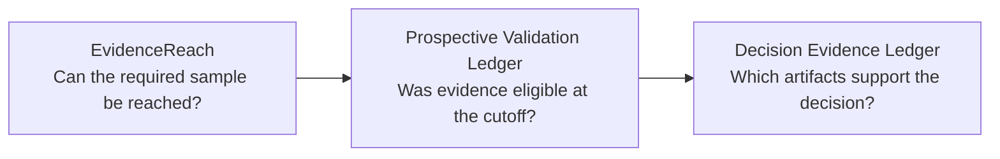

# liver-detox

Local-first, privacy-first tools for making evidence and decisions easier to
check.

## Start with your task

### I have two local sources and need to know whether they agree

[SourceQuorum](https://github.com/liver-detox/SourceQuorum) compares explicitly
supplied local sources. Its synthetic [quickstart](https://github.com/liver-detox/SourceQuorum#quickstart)
returns accepted or rejected and, when records agree, a content-addressed
research release.

[`v0.1.0`](https://github.com/liver-detox/SourceQuorum/releases/tag/v0.1.0) · 486 automated tests · [CI](https://github.com/liver-detox/SourceQuorum/actions) · [Apache-2.0](https://github.com/liver-detox/SourceQuorum/blob/main/LICENSE)

### I want to plan, qualify, and retain the evidence behind a research decision

Three tools keep three questions separate. They can be used alone or in a
manual sequence; the [synthetic walkthrough](https://github.com/liver-detox/prospective-validation-ledger/blob/main/docs/SYNTHETIC_THREE_TOOL_WORKFLOW.md)
shows the handoffs.

- **[EvidenceReach](https://github.com/liver-detox/evidence-reach):** estimate
  required N and scenario reachability — [`v0.1.0`](https://github.com/liver-detox/evidence-reach/releases/tag/v0.1.0) · 63 tests · [CI](https://github.com/liver-detox/evidence-reach/actions)
- **[Prospective Validation Ledger](https://github.com/liver-detox/prospective-validation-ledger):**
  produce an eligible/rejected cutoff receipt — [`v0.1.0`](https://github.com/liver-detox/prospective-validation-ledger/releases/tag/v0.1.0) · 42 tests · [CI](https://github.com/liver-detox/prospective-validation-ledger/actions)
- **[Decision Evidence Ledger](https://github.com/liver-detox/decision-evidence-ledger):**
  retain a verifiable digest-only record — [`v0.1.0`](https://github.com/liver-detox/decision-evidence-ledger/releases/tag/v0.1.0) · 153 tests · [CI](https://github.com/liver-detox/decision-evidence-ledger/actions)

### I want a local Bazi and Zi Wei Dou Shu calculator with review records

[Bazi Ziwei Calculator](https://github.com/liver-detox/bazi-ziwei-calculator) is
an independent local product for dual-chart calculation, candidate review,
revision history, and structured exports. v0.3 adds one-click AI text copying
after a candidate has been confirmed.

[`v0.3.0`](https://github.com/liver-detox/bazi-ziwei-calculator/releases/tag/v0.3.0) · [Quickstart](https://github.com/liver-detox/bazi-ziwei-calculator#五分钟开始使用macos) · [CI](https://github.com/liver-detox/bazi-ziwei-calculator/actions) · [MIT](https://github.com/liver-detox/bazi-ziwei-calculator/blob/main/LICENSE)

## What these projects share

- Local-first workflows with deliberately narrow scopes.
- Synthetic public examples and inspectable outputs.
- No real accounts, holdings, trades, credentials, or private research data.
- Explicit limits; no investment advice, return promises, or automatic trading.

## Project status and boundaries

> These are early-stage open-source projects. They do not claim production adoption, external validation, or investment performance.

## Authorship

I am the sole maintainer of the original projects listed above. I designed them from scratch and developed them iteratively with Codex assistance for implementation, testing, documentation, and review. I remain responsible for their direction, review, and published code. Third-party forks are not presented here as original work.
