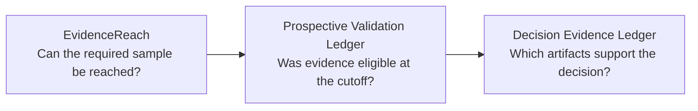

# liver-detox

Local-first, privacy-first open-source tools for auditable evidence and decisions.

I build small Python utilities that keep three questions separate:

1. Can a study reach enough mature evidence?
2. Was the evidence eligible at the declared cutoff?
3. Which exact artifacts support the recorded decision?

> These projects are early-stage open-source utilities. They do not claim production adoption, external validation, or investment performance.

## Three questions, three tools

This is a conceptual workflow with explicit, manual handoffs—not an automatic software integration.

### [EvidenceReach](https://github.com/liver-detox/evidence-reach)

Plans statistical power and evidence-sample reachability. It calculates two-sided one-sample t-test power, required mature sample size, minimum detectable effect, and deterministic evidence-supply scenarios.

[`v0.1.0`](https://github.com/liver-detox/evidence-reach/releases/tag/v0.1.0) · 63 automated tests · [CI](https://github.com/liver-detox/evidence-reach/actions) · [Apache-2.0](https://github.com/liver-detox/evidence-reach/blob/main/LICENSE)

### [Prospective Validation Ledger](https://github.com/liver-detox/prospective-validation-ledger)

Checks whether evidence was eligible at a declared point-in-time cutoff, including sample membership, continuity, duplicates, and artifact digests. It produces a deterministic eligible/rejected receipt.

[`v0.1.0`](https://github.com/liver-detox/prospective-validation-ledger/releases/tag/v0.1.0) · 42 automated tests · [CI](https://github.com/liver-detox/prospective-validation-ledger/actions) · [Apache-2.0](https://github.com/liver-detox/prospective-validation-ledger/blob/main/LICENSE)

### [Decision Evidence Ledger](https://github.com/liver-detox/decision-evidence-ledger)

Creates and verifies digest-only evidence envelopes and ordered decision-record chains using canonical JSON and SHA-256. Records support `ASSERT`, `CORRECT`, and `WITHDRAW` operations.

[`v0.1.0`](https://github.com/liver-detox/decision-evidence-ledger/releases/tag/v0.1.0) · 153 automated tests · [CI](https://github.com/liver-detox/decision-evidence-ledger/actions) · [Apache-2.0](https://github.com/liver-detox/decision-evidence-ledger/blob/main/LICENSE)

## Synthetic walkthrough

The [three-tool synthetic workflow](https://github.com/liver-detox/prospective-validation-ledger/blob/main/docs/SYNTHETIC_THREE_TOOL_WORKFLOW.md) shows the intended boundaries and manual handoffs. Its examples are fabricated demonstrations, not a shared empirical study or financial result.

## Design boundaries

- Local command-line tools; no hosted service or runtime network access.
- Synthetic examples only; no accounts, holdings, trades, broker connections, or market-data adapters.
- Deterministic, inspectable outputs with deliberately small scopes.
- Research utilities, not investment advice or promises of returns.

## Authorship

I am the sole maintainer. I designed these projects from scratch and developed them iteratively with Codex assistance for implementation, testing, documentation, and review. I remain responsible for their direction, review, and published code.
