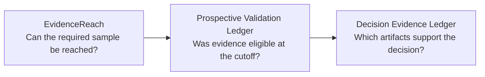

# liver-detox

Local-first, privacy-first open-source tools for auditable evidence and decisions.

I maintain two research-tool lines and one independent product:

- **Analyst research:** source agreement and verifiable research releases.
- **Quantitative research:** evidence reach, point-in-time eligibility, and traceable decision records.
- **Independent product:** a local-first Bazi and Zi Wei Dou Shu calculator.

> These are early-stage open-source projects. They do not claim production adoption, external validation, or investment performance.

## Analyst research

### [SourceQuorum](https://github.com/liver-detox/SourceQuorum)

SourceQuorum compares explicitly supplied local sources and produces a content-addressed research release. Mismatches are rejected. It checks declared agreement and release integrity, not source truth or investment conclusions.

[`v0.1.0`](https://github.com/liver-detox/SourceQuorum/releases/tag/v0.1.0) · 486 automated tests · [CI](https://github.com/liver-detox/SourceQuorum/actions) · [Apache-2.0](https://github.com/liver-detox/SourceQuorum/blob/main/LICENSE)

## Quantitative research

Three small tools keep three questions separate:

This is a conceptual workflow with explicit, manual handoffs—not an automatic software integration.

| Question | Tool | Minimal evidence |
| --- | --- | --- |
| Is enough mature evidence reachable? | [EvidenceReach](https://github.com/liver-detox/evidence-reach) | A power and sample-reach scenario. |
| Was evidence eligible at the cutoff? | [Prospective Validation Ledger](https://github.com/liver-detox/prospective-validation-ledger) | A deterministic eligible/rejected receipt. |
| Is the recorded decision supported? | [Decision Evidence Ledger](https://github.com/liver-detox/decision-evidence-ledger) | A verifiable digest-only record. |

The tools can be used separately or in sequence. The [synthetic three-tool walkthrough](https://github.com/liver-detox/prospective-validation-ledger/blob/main/docs/SYNTHETIC_THREE_TOOL_WORKFLOW.md) demonstrates the intended boundaries without using a real study or financial result.

- **EvidenceReach** — [`v0.1.0`](https://github.com/liver-detox/evidence-reach/releases/tag/v0.1.0) · 63 automated tests · [CI](https://github.com/liver-detox/evidence-reach/actions) · [Apache-2.0](https://github.com/liver-detox/evidence-reach/blob/main/LICENSE)
- **Prospective Validation Ledger** — [`v0.1.0`](https://github.com/liver-detox/prospective-validation-ledger/releases/tag/v0.1.0) · 42 automated tests · [CI](https://github.com/liver-detox/prospective-validation-ledger/actions) · [Apache-2.0](https://github.com/liver-detox/prospective-validation-ledger/blob/main/LICENSE)
- **Decision Evidence Ledger** — [`v0.1.0`](https://github.com/liver-detox/decision-evidence-ledger/releases/tag/v0.1.0) · 153 automated tests · [CI](https://github.com/liver-detox/decision-evidence-ledger/actions) · [Apache-2.0](https://github.com/liver-detox/decision-evidence-ledger/blob/main/LICENSE)

## Independent product

### [Bazi Ziwei Calculator](https://github.com/liver-detox/bazi-ziwei-calculator)

A local-first Bazi and Zi Wei Dou Shu calculator for traceable chart calculation, candidate review, revision history, and structured exports. It provides calculation and review records, not fortune-telling conclusions or professional advice.

[`v0.2.0`](https://github.com/liver-detox/bazi-ziwei-calculator/releases/tag/v0.2.0) · [CI](https://github.com/liver-detox/bazi-ziwei-calculator/actions) · [MIT](https://github.com/liver-detox/bazi-ziwei-calculator/blob/main/LICENSE)

## Shared boundaries

- Local-first workflows with deliberately narrow scopes.
- Synthetic public examples; no real accounts, holdings, trades, credentials, or private research data.
- Deterministic, inspectable outputs and explicit limitations.
- No investment advice, return promises, or automatic trading claims.

## Authorship

I am the sole maintainer of the original projects listed above. I designed them from scratch and developed them iteratively with Codex assistance for implementation, testing, documentation, and review. I remain responsible for their direction, review, and published code. Third-party forks are not presented here as original work.
